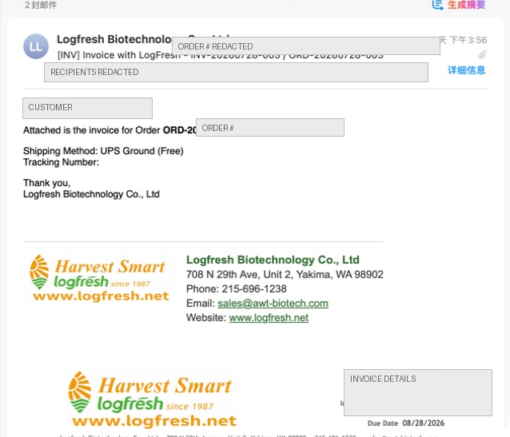
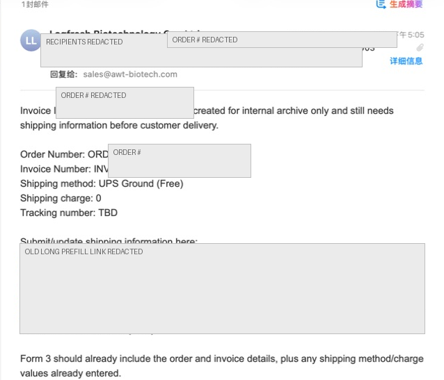

# LogFresh Order and Invoice System Complete Beginner Guide

This guide is written for first-time LogFresh automation users who only need basic computer skills. You do not need to know code. If you can open a web page, fill out a Google Form, check email, and find files in Google Drive, you can follow this guide.

The system mainly does three things:

- Sales enters order information.
- The system automatically generates Order Confirmation or Invoice PDF files.
- The system automatically sends customer emails, internal reminder emails, and organizes customer/order information in Google Sheets.

---

## 1. First, understand the system

This system is built from several Google tools:

| Tool | Purpose | What everyday users do |
|---|---|---|
| Order Confirmation Form | Sales creates orders | Enter order, customer, product, price, and sending options |
| Shipping Update Form | Add shipping/tracking after the customer approves an order | Open it from the internal email button and fill tracking details |
| Invoice Shipping Info Update Form | Add shipping details when an invoice was created internally before tracking was ready | Open it from the internal email button, add tracking, and decide whether to send the final invoice |
| Google Sheet | Backend record sheet | Check statuses, links, and manually generate PDFs when needed |
| Google Docs templates | Order Confirmation / Invoice templates | Everyday users usually do not edit them |
| Google Drive | Stores generated PDFs and Docs files | Find historical Order Confirmations and Invoices |
| Email | Sends customer files and internal reminders | Check customer emails, internal reminders, and test emails |
| Web App approval link | Backend for the customer approval button | Customers click `Approve Order`; they do not need to log in to Google |

Most daily users mainly do this:

1. Open the Order Confirmation Form.
2. Fill the order.
3. Choose the correct workflow.
4. Check email to confirm what the system sent.
5. If needed, click the internal email button to add shipping/tracking.

---

## 2. How to choose the workflow

The most important question in the Order Confirmation Form is `Workflow Type`. There are three options:

```text
Invoice Only
Invoice Only - Needs Shipping Info
Confirmation First
```

### 2.1 Invoice Only

Use this when the customer has already confirmed the order and you can create the invoice directly.

Typical situations:

- The customer already confirmed by phone or email.
- Price, quantity, and addresses are final.
- You do not need to send an Order Confirmation for customer approval first.

The system will:

- Generate the Invoice PDF directly.
- If `Send Confirmation Automatically = Yes`, send the invoice to the customer and CC internal emails.
- If `Send Confirmation Automatically = No`, do not send the customer; send only to Salesperson Email and internal CC for archive.

Simple rule:

```text
Invoice Only + Yes = send invoice directly to customer
Invoice Only + No = do not send customer; send internal archive copy only
```

### 2.2 Invoice Only - Needs Shipping Info

Use this when the customer has already confirmed the order, but tracking number/shipping details are not ready yet.

Typical situations:

- Sales can prepare an invoice record first.
- Warehouse/packing is not complete yet.
- Tracking number will be available later.
- You do not want to send an invoice without tracking to the customer.

The system will:

- Generate an internal invoice first.
- Save that invoice to Drive.
- Not send that first invoice to the customer.
- Send a `[Ship Info]` email to Salesperson Email/internal users.
- Include an `Open Shipping Info Form` button.
- After tracking is ready, click the button to open the Invoice Shipping Info Update Form.
- After the update form is submitted, regenerate the final invoice.
- The new final invoice replaces the earlier invoice that was missing shipping information.

The most important field in the Invoice Shipping Info Update Form is:

```text
Send Invoice Automatically = Yes
```

If it is `Yes`, the final invoice is sent to the customer.  
If it is blank or `No`, the final invoice is sent internally/CC only and not sent to the customer.

Simple rule:

```text
Create internal invoice first
Wait for tracking
Use Invoice Shipping Info Update Form
Then decide whether to send the final invoice to the customer
```

### 2.3 Confirmation First

Use this when the customer needs to approve the order before you create the invoice.

Typical situations:

- The customer has not fully confirmed yet.
- The customer should review the Order Confirmation first.
- Shipping/tracking and invoice should be completed after customer approval.

The system will:

- Generate the Order Confirmation PDF first.
- If `Send Confirmation Automatically = Yes`, send it to the customer.
- Include an `Approve Order` button in the customer email.
- Let the customer approve without logging in to Google.
- Change the order status to `Customer Approved`.
- Send an `[Approved]` email to Salesperson Email/internal users.
- Internal users click the `Open Shipping Update Form` button in that email to add shipping/tracking.
- After the Shipping Update Form is submitted, generate the invoice.
- If the Shipping Update Form has `Send Invoice Automatically = Yes`, send the invoice to the customer.

Simple rule:

```text
Send Order Confirmation first
Customer clicks approve
Internal team adds tracking
Then send invoice
```

---

## 3. Order Confirmation Form: how sales creates an order

The Order Confirmation Form is the main form used by sales. Before filling it out, prepare:

- Customer name/company.
- Customer email.
- Billing address.
- Shipping address.
- Product name, quantity, and unit price.
- Shipping method.
- Payment method.
- Whether the customer should receive the email automatically.

### 3.1 Workflow Type

Choose the current order process:

| Option | When to use |
|---|---|
| `Invoice Only` | Customer already confirmed; send invoice or create internal archive |
| `Invoice Only - Needs Shipping Info` | Customer confirmed, but tracking is not ready |
| `Confirmation First` | Customer needs to approve the order first |

### 3.2 Order Date

Enter the order date. Final business documents use U.S. date format:

```text
MM/dd/yyyy
```

Example:

```text
07/29/2026
```

If Google Form shows a date picker, simply select the date.

### 3.3 Salesperson

Enter the salesperson name, for example:

```text
Barry Foley
```

### 3.4 Salesperson Email

Enter the salesperson's email. This is very important because internal reminders are sent primarily to this address.

Example:

```text
barry@example.com
```

If this is wrong:

- The salesperson may not receive customer approval reminders.
- Internal invoice archive emails may not go to the correct salesperson.
- Shipping update emails may go to the wrong person.

### 3.5 Order Number

Usually leave this blank. The system will generate it automatically.

Format:

```text
ORD-YYYYMMDD-###
```

Example:

```text
ORD-20260729-001
```

This means the first order created on July 29, 2026.

Unless you are very sure you need a manual number, leave it blank.

### 3.6 Invoice Number

Usually leave this blank. The system will generate the matching invoice number from the order number.

Format:

```text
INV-YYYYMMDD-###
```

Example:

```text
INV-20260729-001
```

Normally the order and invoice use the same daily sequence number.

### 3.7 Customer PO

Customer PO means the customer's own purchase order number.

How to fill it:

- If the customer gave you a PO number, enter that PO.
- If the customer did not provide one, leave it blank.
- If the company later requires an internal rule, it can be added later.

Important: Customer PO is not the LogFresh order number and not the invoice number.

### 3.8 Shipped Via

Choose the shipping method.

Common options:

```text
UPS Ground (Free)
UPS Ground
UPS 2nd Day Air
UPS 3rd Day Air
UPS Next Day Air
UPS Next Day Air Early
UPS Ground + UPS Next Day Air Early
USPS Ground
Other
```

If the customer is not in a rush, `UPS Ground (Free)` is commonly used.  
If there is a special shipping request, choose the actual method.

### 3.9 Payment Method

Current fixed options:

```text
Credit Card
Prepaid
Check/Wire Transfer
```

In the U.S., use `Check`, not `Cheque`.

Important: all `Prepaid` orders mean the customer placed/prepaid the order through `logfresh.net`. When sales selects `Prepaid`, confirm that the order came through the LogFresh website order process.

### 3.10 Billing information

Billing information appears as `Bill To` on the invoice.

Fill:

- `Bill To Name`
- `Bill To Company`
- `Bill To Address`
- `Bill To City`
- `Bill To State`
- `Bill To ZIP`
- `Bill To Phone`
- `Bill To Email`

Suggestions:

- Use the full company name when possible.
- Fill address fields separately; do not put City/State/ZIP all inside Address.
- Use U.S. two-letter state abbreviations, such as `CA`, `WA`, or `NY`.
- Put ZIP in the ZIP field only.

### 3.11 Shipping information

Shipping information appears as `Ship To` on the invoice/order confirmation.

If the shipping address is the same as billing, choose:

```text
Same as billing
```

If it is different, fill:

- `Ship To Name`
- `Ship To Company`
- `Ship To Address`
- `Ship To City`
- `Ship To State`
- `Ship To ZIP`
- `Ship To Phone`
- `Ship To Email`

### 3.12 Item/product information

The form supports up to 6 product lines:

```text
Item 1 Quantity
Item 1 Description
Item 1 Unit Price
...
Item 6 Quantity
Item 6 Description
Item 6 Unit Price
```

Rules:

- Quantity is the number of units, for example `100`.
- Description is the product description.
- Unit Price is the price per unit; do not type complicated text.
- Price may be entered as `$2`, `2`, `2.10`, or `2.123`.

Price display rules:

| Input | Displayed in documents |
|---|---|
| `2` | `$2.00` |
| `2.1` | `$2.10` |
| `2.12` | `$2.12` |
| `2.123` | `$2.123` |
| `1234.5` | `$1,234.50` |

Simple rule: two decimals by default; if you enter three or more decimals, the system preserves the extra precision.

### 3.13 Discount

If there is no discount, enter `0` or leave it blank.  
If there is a discount, enter the amount, for example:

```text
25
```

The system subtracts it as a dollar amount.

### 3.14 Shipping Charge

If shipping is free, enter:

```text
0
```

If shipping is charged, enter the amount, for example:

```text
18.50
```

### 3.15 Tax Rate Percent

If there is no tax, enter `0` or leave it blank.  
If there is a tax rate, enter the percentage number. You do not need to type `%`.

For 8.5%, enter:

```text
8.5
```

### 3.16 Customer Email

This is the primary email the system uses when sending to the customer.

Use the customer's final recipient email.  
If this is only a test, do not use a real customer email unless `Test Email Only` is turned on.

### 3.17 Send Confirmation Automatically

This option controls whether the system sends email automatically.

Even though the field is named `Send Confirmation Automatically`, it is the shared sending switch for the Order Confirmation Form.

| Workflow | If Yes | If No |
|---|---|---|
| Invoice Only | Invoice is sent to customer and CC internal emails | Invoice is not sent to customer; it is sent to salesperson/internal users for archive |
| Invoice Only - Needs Shipping Info | First stage does not send customer; it sends internal shipping info reminder | Same first-stage behavior; it sends internal shipping info reminder |
| Confirmation First | Order Confirmation is sent to customer | PDF is generated only; customer is not emailed automatically |

If you are not sure, first use `Test Email Only` from the LogFresh menu.

---

## 4. Workflow 1: Invoice Only

### 4.1 When to use it

Use this when the customer already confirmed the order and you can create the invoice directly.

### 4.2 Steps

1. Open the Order Confirmation Form.
2. Choose `Invoice Only` for `Workflow Type`.
3. Fill customer information, address, products, and prices.
4. If you want to send the invoice to the customer, choose `Yes` for `Send Confirmation Automatically`.
5. If you only want an internal archive copy, choose `No`.
6. Click Submit.

### 4.3 What happens after submission

The system will:

- Generate the Order Number automatically.
- Generate the Invoice Number automatically.
- Generate the Invoice PDF.
- Save the file to the Invoice Drive folder.
- Update `Invoice URL` in the Google Sheet.
- Update `Order Status`.
- Update Customer Info.

If customer sending is enabled:

- The customer receives `[INV] Invoice with LogFresh`.
- Internal fixed emails are CC'd.
- The salesperson email is also CC'd.

If customer sending is not enabled:

- The customer does not receive it.
- Salesperson/internal emails receive `[INV Internal] Invoice archive copy`.

---

## 5. Workflow 2: Invoice Only - Needs Shipping Info

### 5.1 When to use it

Use this when the order is confirmed but the tracking number is not ready yet.

### 5.2 First stage: sales submits the order

1. Open the Order Confirmation Form.
2. Choose `Invoice Only - Needs Shipping Info`.
3. Fill customer, products, prices, and shipping method.
4. Tracking Number can be blank for now.
5. Submit.

### 5.3 What the system does first

The system will:

- Generate an internal invoice.
- Save it to the Invoice Drive folder.
- Not send it to the customer.
- Set the order status to `Awaiting Shipping Info`.
- Send a `[Ship Info] Invoice needs shipping info` email to Salesperson Email/internal users.

The email includes a button:

```text
Open Shipping Info Form
```

### 5.4 Second stage: after shipping/tracking is ready

1. Open the `[Ship Info]` email.
2. Click `Open Shipping Info Form`.
3. Check that Order Number / Invoice Number are already prefilled.
4. Enter `Tracking Number`.
5. Check or fill `Shipped Via`.
6. Fill or confirm `Shipping Charge`.
7. Check `Invoice Date`.
8. Check `Due Date`.
9. Check `Payment Method`.
10. Check `Customer Email`.
11. If you want to send the final invoice to the customer, choose `Yes` for `Send Invoice Automatically`.
12. If you only want internal archive, choose `No` or leave it blank.
13. Submit.

If an order has multiple packages, enter one tracking number per line in `Tracking Number`. You may add simple notes, for example:

```text
1Z123456789 - Box 1
1Z987654321 - Box 2
9400110200881234567890 - USPS small box
```

### 5.5 What happens after the Invoice Shipping Info Update Form is submitted

The system will:

- Find the original order.
- Write shipping/tracking back to the main sheet.
- Regenerate the invoice.
- Delete/replace the earlier invoice that was missing shipping.
- If `Send Invoice Automatically = Yes`, send it to the customer.
- If blank or `No`, send internally/CC only.

---

## 6. Workflow 3: Confirmation First

### 6.1 When to use it

Use this when the customer needs to confirm the order details before invoicing.

### 6.2 First stage: sales submits the Order Confirmation Form

1. Open the Order Confirmation Form.
2. Choose `Confirmation First`.
3. Fill the full order.
4. Choose `Yes` for `Send Confirmation Automatically`.
5. Submit.

### 6.3 What the customer receives

The customer receives an email:

```text
[ORD] Order Confirmation with LogFresh - ORD-YYYYMMDD-###
```

The email includes:

- Order Confirmation PDF.
- `Approve Order` button.

The customer does not need to log in to Google after clicking the button.

The button uses this deployed Apps Script Web App:

```text
https://script.google.com/macros/s/AKfycbzTCUmG5RLjUoalUT_sM0MV1rkx2kuewbzqrdszYFHlRVkF7BMIUKWK9OjplnrQGJ2n/exec
```

The system is configured as:

```text
Execute as: USER_DEPLOYING
Access: ANYONE_ANONYMOUS
```

Everyday sales users do not need to manage this link. They only need to make sure the `Approve Order` button in the customer email opens.

### 6.4 What happens after the customer clicks approve

The system will:

- Change the order status to `Customer Approved`.
- Record `Customer Approved At`.
- Send `[Approved] Order Confirmation needs shipping info` to Salesperson Email/internal emails.
- Show an `Open Shipping Update Form` button in that email, instead of showing a long raw prefilled URL.

### 6.5 Internal users submit the Shipping Update Form

Open the `[Approved]` email and click the `Open Shipping Update Form` button. Fill:

- `Order Number`
- `Ship Date`
- `Shipped Via`
- `Tracking Number`
- `Invoice Number`
- `Invoice Date`
- `Due Date`
- `Payment Method`
- `Customer Email`
- `Send Invoice Automatically`
- `Internal Notes`

If there are multiple packages, `Tracking Number` can have multiple lines, one tracking number per line.

If `Send Invoice Automatically = Yes`:

- The system generates the final invoice.
- The invoice is sent to the customer.
- Internal emails are CC'd.

If blank or `No`:

- The system generates the invoice.
- It does not send the customer.
- It sends internally/CC for archive.

---

## 7. How to read the Google Sheet

The Google Sheet is the backend record sheet. Everyday users usually do not need to manually edit much, but they should know how to read statuses.

### 7.1 Main tabs

| Tab | Purpose |
|---|---|
| `Order Confirmation` | Main order records; Order Confirmation Form responses and system results are here |
| `Shipping Updates` | Responses from the Shipping Update Form / Invoice Shipping Info Update Form |
| `Customer Info` | Customer/order summary, useful for Excel export |

### 7.2 Common columns

| Column | Meaning |
|---|---|
| `Order Number` | System order number |
| `Invoice Number` | System invoice number |
| `Order Status` | Current order status |
| `Order Confirmation URL` | Order Confirmation PDF link |
| `Customer Approval URL` | Customer approval link |
| `Invoice URL` | Invoice PDF link |
| `Order Confirmation Sent At` | Time the Order Confirmation was sent |
| `Customer Approved At` | Time the customer approved |
| `Invoice Sent At` | Time the invoice was sent to the customer |
| `Invoice Internal Archive Sent At` | Time the internal invoice archive was sent |
| `Internal Notes` | Error notes or internal notes |

### 7.3 How to read Order Status

| Status | Meaning |
|---|---|
| `Pending Customer Approval` | Order Confirmation has been generated/sent and is waiting for customer approval |
| `Customer Approved` | Customer clicked approve |
| `Awaiting Shipping Info` | Waiting for shipping/tracking details |
| `Invoice Created` | Invoice has been generated |
| `Invoice Sent` | Invoice has been sent to the customer |

---

## 8. How to use the LogFresh menu

After opening the Google Sheet, the top menu should show:

```text
LogFresh
```

If you do not see it:

- Refresh the page.
- Wait a few seconds.
- Confirm you opened the correct response spreadsheet.

### 8.1 Generate Order Confirmation for Selected Row

Purpose: manually generate an Order Confirmation for the selected row.

Steps:

1. Click the order row.
2. Click `LogFresh`.
3. Click `Generate Order Confirmation for Selected Row`.

Use this when:

- Automatic generation failed and you need to retry.
- The Order Confirmation Form was submitted, but you need to generate the file again.

### 8.2 Generate & Email Invoice for Selected Row

Purpose: manually generate and send an invoice for the selected order.

Important: this sends email. For testing, turn on `Test Email Only` first.

### 8.3 Generate Invoice PDF Only for Selected Row

Purpose: generate only the invoice PDF without sending any email.

Use this when:

- You want to preview the PDF first.
- You only want to save the file to Drive.
- You do not want the customer or internal team to receive an email.

### 8.4 Rebuild Customer Info Sheet

Purpose: rebuild the Customer Info summary.

Use this when:

- Customer Info is missing records.
- Historical orders were edited.
- You want to rebuild the customer summary from the main order sheet.

### 8.5 Test Email Only

Purpose: safely test emails and avoid sending to customers by mistake.

After turning it on:

- All automated emails go only to `mcp@logfresh.net`.
- Real customers do not receive emails.
- Other CC recipients do not receive emails.
- Email subjects start with `[TEST EMAIL ONLY]`.
- The email top section shows the original To / Cc / Bcc so you can check who would have received it.

Use it when:

- Testing a new order.
- Testing a new template.
- Testing before using a real customer email.
- You are not sure who the system will email.

### 8.6 Back to Normal

Purpose: restore normal sending.

After turning it on:

- Customer emails are sent to customers normally.
- Internal CC is restored.
- Automation returns to production mode.

Very important: after testing, if you want to use the system for real orders, click `Back to Normal`.

### 8.7 Test Latest Row: Order Confirmation

Purpose: test Order Confirmation generation for the latest row.

Everyday sales users usually do not need this. It is mainly for administrator testing.

---

## 9. How to read emails

### 9.1 Customer Order Confirmation email

Subject example:

```text
[ORD] Order Confirmation with LogFresh - ORD-20260729-001
```

Attachment:

- Order Confirmation PDF

Button:

```text
Approve Order
```

After the customer clicks the button, the system records the approval.

### 9.2 Customer Invoice email

Subject example:

```text
[INV] Invoice with LogFresh - INV-20260729-001 / ORD-20260729-001
```

Below is an Apple Mail invoice email example. The screenshot is redacted; the real email shows the real customer email, order number, and attachment preview.



Attachment:

- Invoice PDF

The email shows:

- Order Number.
- Shipping Method.
- Tracking Number(s).

### 9.3 Internal Order Approved email

Subject example:

```text
[Approved] Order Confirmation needs shipping info - ORD-20260729-001
```

Purpose:

- The customer has approved the order.
- Internal team needs to add shipping/tracking.
- Then the invoice can be generated.

The email includes a button:

```text
Open Shipping Update Form
```

After clicking the button, the Shipping Update Form opens with Order Number, shipping method, payment method, customer email, and related information already prefilled.  
If the button does not open, the email still keeps a small fallback link below the button.

### 9.4 Internal Invoice Shipping Info email

Subject example:

```text
[Ship Info] Invoice needs shipping info - INV-20260729-001 / ORD-20260729-001
```

The email includes a button:

```text
Open Shipping Info Form
```

Click it to add tracking and decide whether to send the final invoice to the customer.

The screenshot below is from an earlier test email. It still shows a long link in the screenshot; the current version displays a button instead, to avoid long links being wrapped or broken by email clients. The screenshot is redacted.



### 9.5 Internal Invoice Archive email

Subject example:

```text
[INV Internal] Invoice archive copy - INV-20260729-001 / ORD-20260729-001
```

Meaning:

- The invoice was generated.
- It was not sent to the customer.
- This email is only for internal archive.

---

## 10. How to find files in Google Drive

The system saves files into separate folders:

| File type | Saved in |
|---|---|
| Order Confirmation | Order Confirmation folder |
| Invoice | Invoice folder |

File names usually look like:

```text
Order Confirmation ORD-20260729-001 - Customer Company
Invoice INV-20260729-001 - Customer Company
```

File names now use the customer company name, not the individual contact name.

If an invoice is updated later:

- A new invoice is generated.
- The old duplicate invoice is moved to Drive trash.
- This avoids keeping multiple old invoices for the same order.

---

## 11. How to use Customer Info

Customer Info is the customer/order summary sheet. It is useful for Excel export, customer analysis, filtering by city/state/ZIP, and checking order amounts.

Common columns include:

- Customer Name.
- Company.
- Phone.
- Email.
- Billing Address.
- Billing City.
- Billing State.
- Billing ZIP.
- Payment Method.
- Order Date.
- Order Number.
- Invoice Number.
- Tracking Number.
- Product Summary.
- Order Total.
- Notes.

Important:

- Customer Info is recorded by order, not one row per customer.
- If the same customer has two orders on the same day, there should be two rows.
- If records are missing, use `LogFresh > Rebuild Customer Info Sheet` from the Sheet menu.

---

## 12. Recommended safe testing process for beginners

For first-time use, strongly test this way:

### Step 1: Turn on test email mode

In the Google Sheet:

```text
LogFresh > Test Email Only
```

After the confirmation message appears, test mode is on.

### Step 2: Submit one test Order Confirmation Form

Recommended first test:

```text
Workflow Type = Invoice Only
Send Confirmation Automatically = Yes
Customer Email = your own email or a test email
```

Because Test Email Only is on, even if Customer Email is a real customer email, the customer will not actually receive it.

### Step 3: Check mcp@logfresh.net

Look for:

```text
[TEST EMAIL ONLY] [INV] Invoice with LogFresh ...
```

The top of the email shows who the email would have gone to.

### Step 4: Check the PDF

Open the email attachment or the `Invoice URL` in the Sheet.

Check:

- Company name.
- Address.
- Date format.
- Price.
- Quantity.
- Total.
- Payment method.
- Shipping method.
- Customer email.
- Tracking number.

### Step 5: Return to normal mode

After testing is successful, in the Google Sheet click:

```text
LogFresh > Back to Normal
```

Only after that will the system send to customers/internal CC normally.

---

## 13. Common errors and how to fix them

### 13.1 No email received

First check:

1. Is `Test Email Only` turned on?
2. If yes, email only goes to `mcp@logfresh.net`.
3. Check spam/junk.
4. Check whether Customer Email is blank or wrong.
5. Check whether Salesperson Email is blank or wrong.
6. Check Apps Script execution history for errors.

If testing is complete but the system is still in test mode:

```text
LogFresh > Back to Normal
```

### 13.2 Customer says they did not receive it

Check:

- Does the Sheet have a time in `Invoice Sent At` or `Order Confirmation Sent At`?
- Is Customer Email correct?
- Did it go to the customer's spam folder?
- Was `Test Email Only` still on at that time?
- Was `Send Confirmation Automatically = No` or `Send Invoice Automatically = No` selected?

### 13.3 Shipping Update Form / Invoice Shipping Info Update Form says it cannot find the order

Common reasons:

- `Order Number` was blank.
- `Order Number` was typed incorrectly.
- The Order Number in the update form does not match the main sheet.
- Part of the link was missed when copied.
- The user opened a blank form manually and did not enter Order Number.

Fix:

1. Find the correct `Order Number` in the main sheet.
2. Copy the full number.
3. Resubmit the Shipping Update Form / Invoice Shipping Info Update Form.
4. If it still fails, check `Processing Status` in the `Shipping Updates` tab.

### 13.4 Address is blank

Check:

- Was Bill To Address filled?
- Were Bill To City / State / ZIP filled separately?
- Was Shipping Address Option selected correctly?
- If Ship To is different from Bill To, was the full Ship To address filled?

### 13.5 PDF price decimals look wrong

Current rule:

- Two decimals by default.
- Three or more decimals are preserved.

If input is `2`, `$2.00` is correct.  
If input is `2.123`, `$2.123` is correct.

### 13.6 Two invoices were generated

Normally, when the Shipping Update Form / Invoice Shipping Info Update Form creates a newer invoice, it replaces the old invoice.  
If you still see an old file in Drive, possible reasons are:

- The old file did not use the same naming rule.
- The old file was manually copied.
- The old file is in a different folder.
- The replacement logic was not enabled when the old file was created.

Fix:

- Use the latest `Invoice URL` in the Sheet as the source of truth.
- If unsure, ask an administrator to check.

### 13.7 Menu click does nothing

Check:

- Did you select the correct order row?
- Was an authorization pop-up blocked by the browser?
- Did you refresh the Sheet and try again?
- Are you in the correct Google Sheet?
- Does Apps Script show an execution error?

---

## 14. Daily use by role

### 14.1 Salesperson

Main daily tasks:

1. Fill the Order Confirmation Form.
2. Choose the correct Workflow Type.
3. Fill Salesperson Email.
4. Check the customer email address.
5. Check whether internal reminders arrive.
6. If needed, click the internal email button to add shipping/tracking.

### 14.2 Shipping / Packing team

Main daily tasks:

1. Wait for `[Ship Info]` or `[Approved]` emails from sales/the system.
2. Click the update form button in the email.
3. Enter tracking number.
4. Check shipped via / shipping charge.
5. Submit.

### 14.3 Administrator / system maintainer

Should know how to:

- Turn on `Test Email Only`.
- Restore `Back to Normal`.
- Manually generate PDF from the Sheet menu.
- Check Apps Script execution logs.
- Rebuild Customer Info.
- Check Drive folders.
- Check whether Form field names were accidentally changed.

---

## 15. Things not to casually change

Do not casually change these, or the system may fail to match fields:

- Google Form question titles.
- Google Sheet tab names.
- Google Sheet first-row headers.
- Google Docs template placeholders.
- Apps Script template IDs / folder IDs / form IDs.
- Web App deployment.
- The customer approval Web App URL in `CONFIG.WEB_APP_URL`.
- Apps Script trigger.

If a form question title must be changed, the script field names must be updated at the same time.

---
